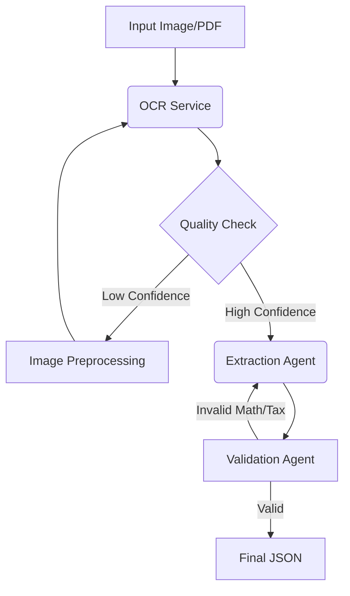

# Architecture & Design Review

This document details the engineering decisions, architectural patterns, and trade-offs made during the development of the Invoice Extraction System.

## 🏗 High-Level Architecture

The system follows an **Asynchronous Event-Driven Architecture** decoupled into three main layers:

1.  **Ingestion Layer (FastAPI)**: Lightweight, non-blocking API that accepts uploads and pushes jobs to a queue.
2.  **Message Broker (Redis)**: Acts as the persistent buffer between ingestion and processing.
3.  **Processing Layer (Celery Workers)**: Scalable worker nodes that execute the heavy AI pipeline.

**Why this architecture?**
OCR and LLM inference are high-latency operations (5-30s). A synchronous API would timeout or block under load. This design ensures the API remains responsive (sub-100ms latency) regardless of the queue depth.

---

## 🛠 Decision Log & Trade-offs

### 1. OCR Engine: PaddleOCR vs. Tesseract vs. EasyOCR
| Engine | Decision | Rationale |
| :--- | :--- | :--- |
| **PaddleOCR** | **Primary** | Significantly higher accuracy on table structures and dense text compared to Tesseract. |
| **EasyOCR** | **Fallback** | Used as a redundant fallback. While slower, it has excellent support for diverse language scripts if Paddle fails. |
| **Tesseract** | Rejected | Requires extensive image preprocessing (binarization, skew correction) to match modern Deep Learning OCRs. |

### 2. Async Backend: Celery/Redis vs. Kafka/RabbitMQ
| Option | Decision | Rationale |
| :--- | :--- | :--- |
| **Celery + Redis** | **Selected** | Native Python integration, minimal setup overhead, sufficient for the expected throughput (<1000 req/sec). |
| **Kafka** | Rejected | High maintenance overhead (ZooKeeper, multiple brokers) unnecessary for this scale. |

### 3. LLM Orchestration: Agentic Pattern
We implemented a **Linear Pipeline Pattern** rather than a complex autonomous loop to ensure deterministic results.

- **Orchestrator**: `worker.py` (Manages state and error handling)
- **Tools**: `OCRService`, `ExtractionAgent`, `DecisionAgent`

---

## 🤖 Agentic Design Patterns

The pipeline effectively functions as a sequential chain of specialized agents:



1.  **OCR Agent**: Handles image-to-text conversion with automatic retry logic using different parameters or engines (Paddle -> EasyOCR).
2.  **Extraction Agent**: A stateless LLM wrapper that injects OCR text into a strict Pydantic schema. It supports switching between providers transparently.
3.  **Validation Logic (Critic)**: Instead of a separate LLM, we implemented **deterministic code-based validation** (`validators.py`) for:
    *   VAT Calculation (`Total * 0.18 == Tax`)
    *   Line Item Arithmetic (`Qty * UnitPrice == LineTotal`)
    *   *Note: Code validators are faster and more reliable than LLM critics for math.*

---

## 🔌 Local vs. Cloud LLM Abstraction

The system implements a **Provider Strategy Pattern** to support both Local and Cloud LLMs without code changes.

- **Interface**: `ExtractionAgent` relies on `pydantic-ai`'s unified model interface.
- **Switching Mechanism**: Controlled entirely via environment variables (`.env`).

```python
# logic in ExtractionAgent
if settings.llm_provider == "ollama":
    self.model = f"ollama:{settings.ollama_model}" # e.g., llama3.2
else:
    self.model = f"openai:{settings.openai_model}" # e.g., gpt-4o
```

This abstraction allows running the stack on an air-gapped machine (using Ollama) or scaling to production (using OpenAI) by changing a single config line.
